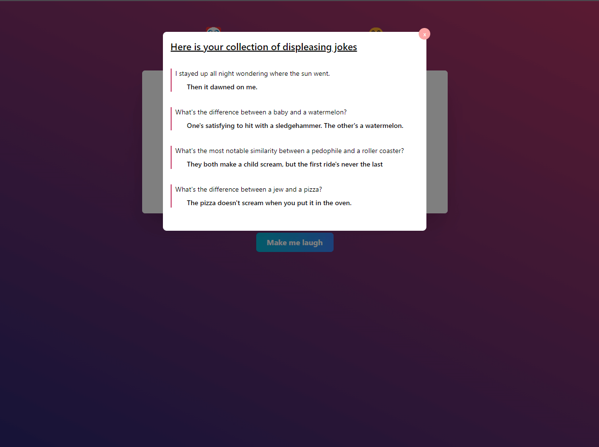
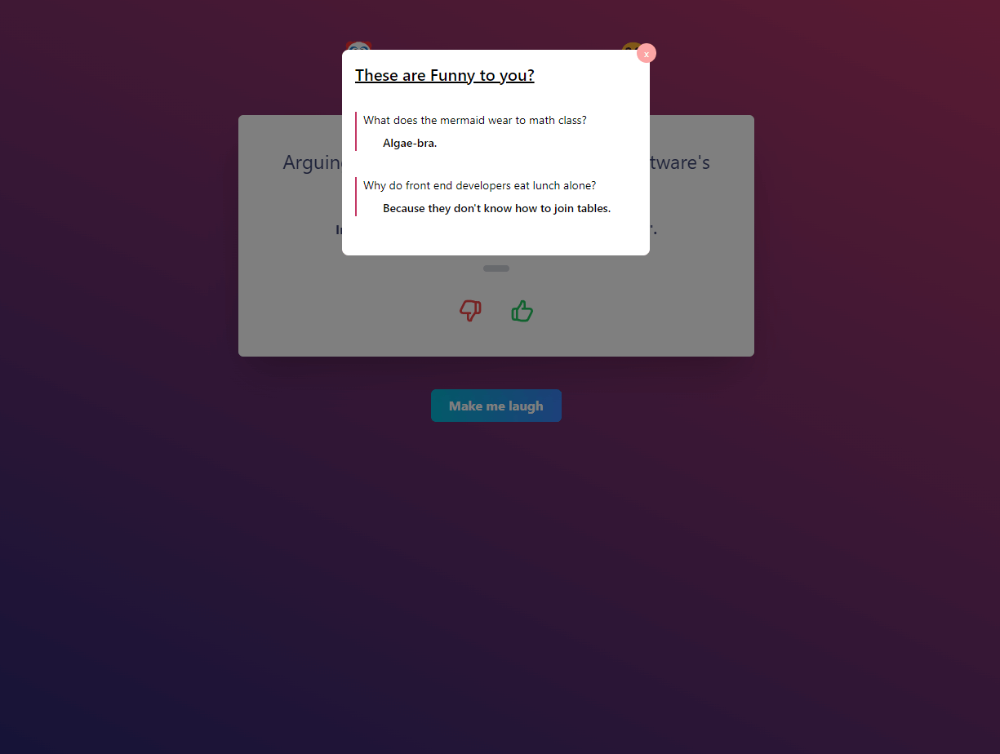

# React Tailwind Random Joke generator using jokeapi.dev

## DEMO

https://random-joke-api.vercel.app/

### Packages

- axios
- react hooks
- framer-motion
- tailwind

### Clone

- git clone
- open folder
- npm install
- npm start

### `further enhancing my tailwind familiarization`

### `exploring more animation using framer-motion`

- 💩 jokes

- 👌 jokes

